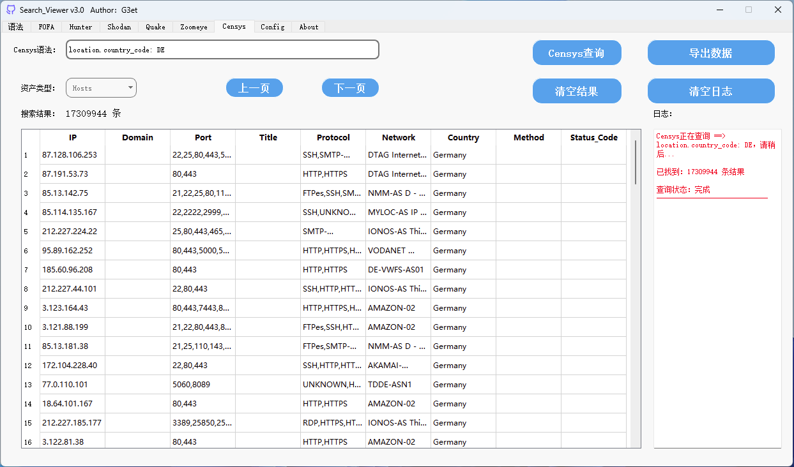
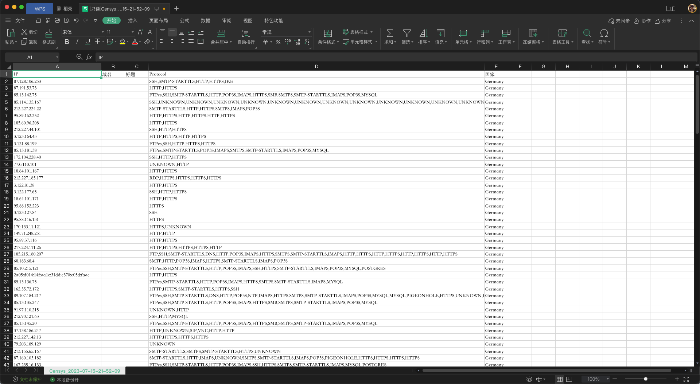

# 支持的平台

支持一键导出

## FOFA

1.默认展示10000条数据

2.支持iconhash查询，输出的iconhash复制到输入框点击查询即可

3.点击查询会覆盖已查询的内容

## 鹰图

1.默认展示20条数据，最高100条 

2.可以自己输入页码，默认第一页 

3.每次查询可以看到消耗积分和剩余积分

4.当日重复查询的语句，不会累计扣积分

5.可以自己选择资产类型，默认web资产

6.点击查询会覆盖已查询的内容

7.暂不支持查询iconhash，之后版本可能会新增

## shodan

1.默认展示100条，可翻页   

2.shodan搜索速度可能比其他的空间测绘慢一些，点击查询后没必要再次点击查询，请耐心等待即可   

 

3.搜索方法：如果需要搜索shodan语句选择HOST方法，如果需要搜索IP选择IP即可，选错可能会影响到搜索结果

4.点击查询不会覆盖已查询的内容

5.只能导出已查询出来的内容，可能之后版本会解决

## 360 Quake

1.支持360 Quake语法

2.默认查询20页，最大查询499条

3.自动展示去重

4.可查询本月剩余积分

5.暂无法查询到域名信息

## Zoomeye 钟馗之眼

1.提供三个资产类型，分别是主机设备、关联域名、子域名，默认关联域名查询

2.关联域名、子域名默认查询30条，主机设备默认查询20条，可翻页

3.导出提供两个按钮分别有“导出主机设备”、“导出关联域名/子域名”，注意：选择的资产类型比如是“主机设备”，你导出的时候也必须选择导出“主机设备” 如果选了另一项系统第一次则会自动提示，第二次则不会提示直到退出后重新进入

## Censys

1.一页最多展示100条数据,可翻页 

2.注意资产搜索类型

# 语法

# 配置

# 版本

## v1.0 2022/11/12

·支持多线程解决大多数GUI假死状况

·支持fofa iconhash

·鹰图可查看个人积分信息可选择资产类型查询

·shodan语法和IP单独模块

·支持一键导出 

## v2.0 2023/02/17

·修复导出时间戳

·修复Hunter情况恢复页码

·界面稍微调整

·新增360 Quake

·新增Zoomeye 钟馗之眼

## v3.0 2023/7/15

·新增Censys

·quake和zoomeye代码优化调整

·界面改动,新增语法参考

·修复查询过大闪退问题

·修复导出时间戳被覆盖问题

·修复已知BUG

# 注意

第一次使用选择保存，之后需要修改api点击修改即可，如果再点击保存将覆盖所有已经配置的API，则需要重新再配置
