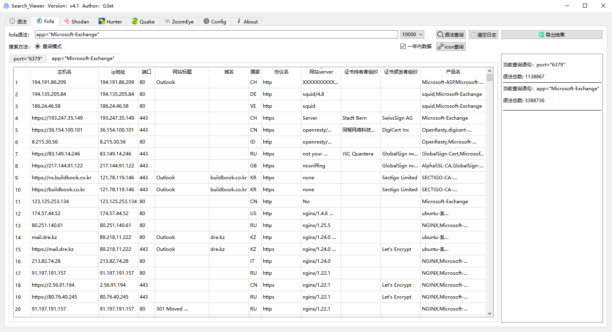

# 支持的平台

## FOFA

1.默认展示10000条数据

2.支持iconhash查询，输出的iconhash复制到输入框点击查询即可

3.点击查询会覆盖已查询的内容

## 鹰图

1.默认展示20条数据，最高100条 

2.可以自己输入页码，默认第一页 

3.每次查询可以看到消耗积分和剩余积分

4.当日重复查询的语句，不会累计扣积分

5.可以自己选择资产类型，默认web资产

6.点击查询会覆盖已查询的内容

7.暂不支持查询iconhash，之后版本可能会新增

## shodan

1.默认展示100条，可翻页   

2.shodan搜索速度可能比其他的空间测绘慢一些，点击查询后没必要再次点击查询，请耐心等待即可   

 

3.搜索方法：如果需要搜索shodan语句选择HOST方法，如果需要搜索IP选择IP即可，选错可能会影响到搜索结果

4.点击查询不会覆盖已查询的内容

5.只能导出已查询出来的内容，可能之后版本会解决

# 版本

版本：v1.0 2022/11/12

·支持多线程解决大多数GUI假死状况

·支持fofa iconhash

·鹰图可查看个人积分信息可选择资产类型查询

·shodan语法和IP单独模块

·支持一键导出 

# 注意

第一次使用选择保存，之后需要修改api点击修改即可，如果再点击保存将覆盖所有已经配置的API，则需要重新再配置
