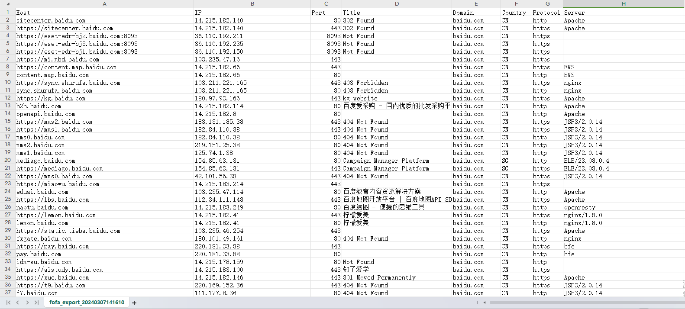
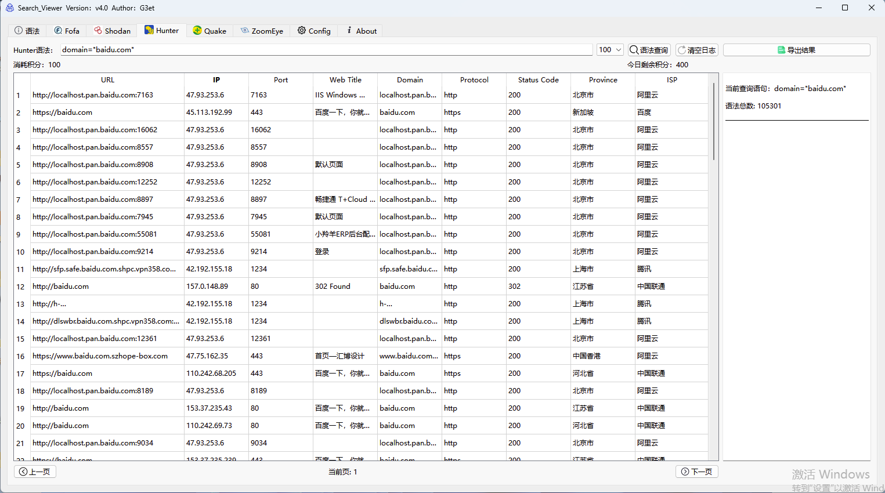
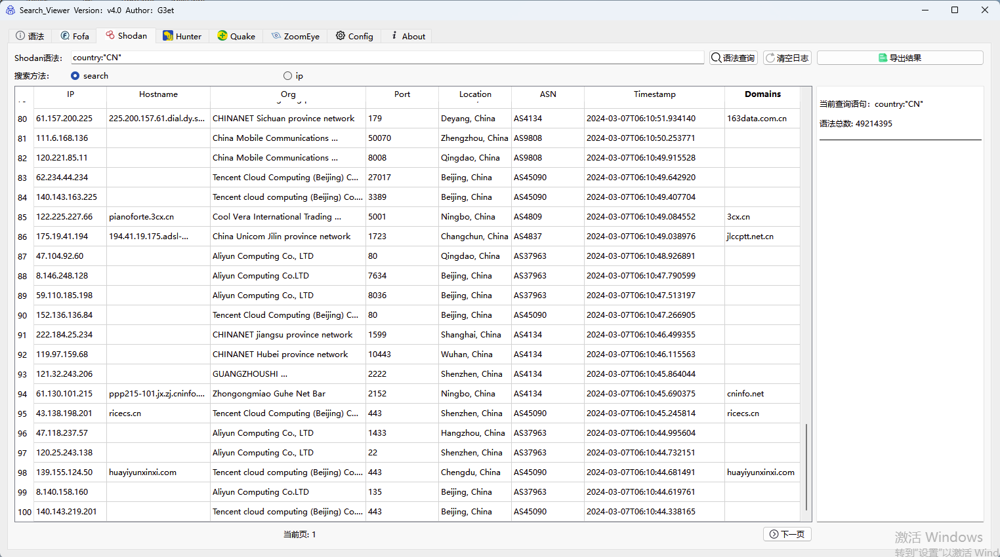
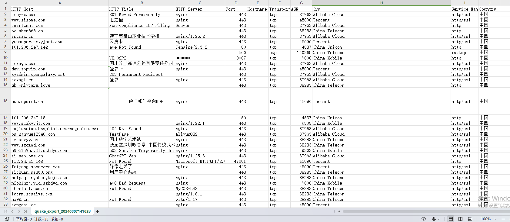
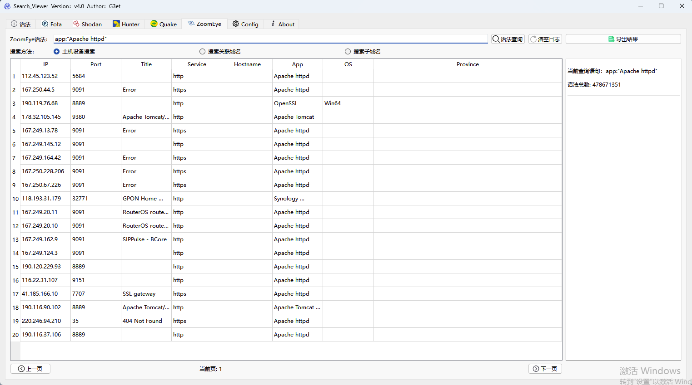
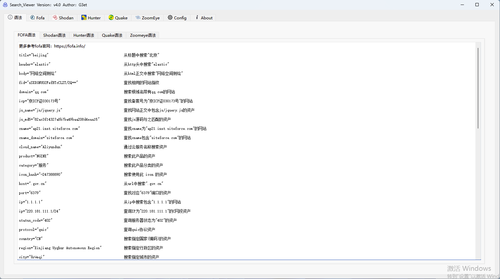

## 注：最新版v4.0版本为QT C++重构 不再开源，由于C++编写iconhash无法和官方iconhash对应 采用python写的 预编译在工具中 会在temp创建临时文件iconhash.exe 因此可能会出现杀软误报问题！

v4.1对fofa及功能做了很多优化及改变，支持多窗口展示，支持排序，所有平台支持自定义域名

## v3.0以下版本支持的平台

基于python pyside2库实现的，支持windows macos，windows至少需要win7以上系统才能运行，支持一键导出

## FOFA

1.默认展示10000条数据

2.支持iconhash查询，输出的iconhash复制到输入框点击查询即可

3.点击查询会覆盖已查询的内容

## 鹰图

1.默认展示10条数据，可翻页 

2.每次查询可以看到消耗积分和剩余积分

3.当日重复查询的语句，不会累计扣积分

4.点击查询会覆盖已查询的内容

5.暂不支持查询iconhash，之后版本可能会新增

## shodan

1.默认展示100条，可翻页   

2.shodan搜索速度可能比其他的空间测绘慢一些，点击查询后没必要再次点击查询，请耐心等待即可   
 
3.搜索方法：如果需要搜索shodan语句选择Search方法，如果需要搜索IP选择IP即可，选错可能会影响到搜索结果

4.点击查询不会覆盖已查询的内容

5.只能导出已查询出来的内容，可能之后版本会解决

## 360 Quake

1.支持360 Quake语法

2.默认查询10条，最大500条，可翻页

## Zoomeye 钟馗之眼

1.提供三个资产类型，分别是主机设备、关联域名、子域名，默认关联域名查询

2.关联域名、子域名默认查询30条，主机设备默认查询20条，可翻页

# 语法

# 配置

# 版本

## v4.1 2024/6/15

·fofa界面搜索不再覆盖,每次查询有新窗口,双击可关闭

·修复查询时页码问题

·fofa新增排序,新增多个字段

·新增自定义域名

## 版本：v4.0 2024/3/6

·去除Censys

·使用QT C++重构该项目

·新增回车查询、右键打开浏览器、导出可自选路径、支持缩放、支持全选

·修复查询过大闪退问题

·修复已知BUG

·新增翻页按钮

## 版本：v3.0 2023/7/15

·新增Censys

·quake和zoomeye代码优化调整

·界面改动,新增语法参考

·修复查询过大闪退问题

·修复导出时间戳被覆盖问题

·修复已知BUG

## 版本：v2.0 2023/02/17

·修复导出时间戳

·修复Hunter情况恢复页码

·界面稍微调整

·新增360 Quake

·新增Zoomeye 钟馗之眼

## 版本：v1.0 2022/11/12

·支持多线程解决大多数GUI假死状况

·支持fofa iconhash

·鹰图可查看个人积分信息可选择资产类型查询

·shodan语法和IP单独模块

·支持一键导出 
